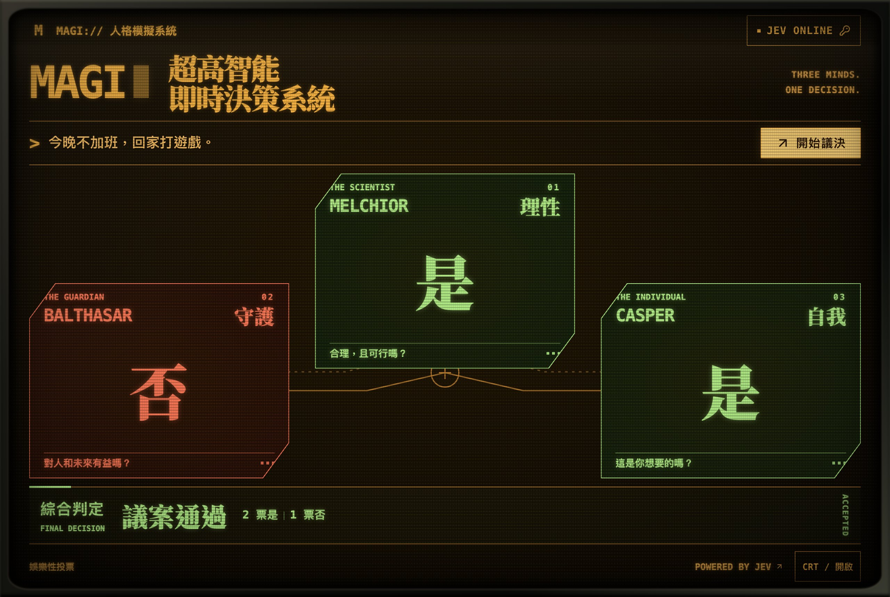

# Jev MAGI

中文 | [English](README.en.md)

三个人格对同一个议案分别投「是」或「否」，两票及以上即通过。判断由 [TypeSafe Jev](https://docs.typesafe.ai/primitives/noul) 完成，界面为繁体中文。



- **MELCHIOR · 理性**：合理，且可行吗？
- **BALTHASAR · 守护**：对人和未来有益吗？
- **CASPER · 自我**：这是你想要的吗？

三个判断互相独立。无法用「是」或「否」回答的输入，例如二选一或开放式提问，三个单元都会显示「錯誤」。

## 下载

在 [Releases](https://github.com/vanawaker/jev-magi/releases) 页面下载对应平台的安装包：

| 平台 | 文件 |
| --- | --- |
| macOS（Apple 芯片和 Intel） | `.dmg` |
| Windows | `.exe` |
| Linux | `.AppImage` |
| Android | `.apk` |

打开后点击「開始議決」，填入 [TypeSafe API Key](https://console.typesafe.ai/keys) 即可。Key 保存在本机：macOS 存入钥匙串，Windows 存入凭据管理器，Linux 存入系统密钥环（没有密钥环服务时只在本次运行中有效），Android 存入应用私有存储。Key 只用于向 TypeSafe 发送请求。

安装包由 GitHub Actions 自动构建。**只有 macOS 版经过实际测试；Windows、Linux 和 Android 版未经测试，可能存在各种问题。**

首次打开时可能遇到系统提示：

- **macOS**：如果提示无法验证开发者，前往「系统设置 → 隐私与安全性」，点击「仍要打开」。
- **Windows**：如果出现「Windows 已保护你的电脑」，点击「更多信息」，再点击「仍要运行」。
- **Android**：需要在系统设置中允许安装未知来源的应用。

## 从源码运行

适合想自己部署的用户。需要 Node.js 22.18 或更高版本，以及一个 [TypeSafe API Key](https://console.typesafe.ai/keys)。

```sh
git clone https://github.com/vanawaker/jev-magi.git
cd jev-magi
npm install
npm start
```

打开 <http://127.0.0.1:3000>，点击「開始議決」，按提示填入 Key 即可。

## 从源码运行时填写 Key 的两种方式

- **在页面上填写**：Key 只保存在当前页面的内存中，刷新即清除。
- **写入配置文件**：把 `.env.example` 复制为 `.env`，填入 `TYPESAFE_API_KEY`，重新运行 `npm start`，之后打开页面即可直接使用。

两者同时存在时，以页面上填写的 Key 为准。议案和 Key 会经本服务转发给 TypeSafe，本服务不保存它们。

## 配置

| 变量 | 默认值 | 说明 |
| --- | --- | --- |
| `TYPESAFE_API_KEY` | 空 | 服务端使用的 Key；留空则在页面上填写 |
| `HOST` | `127.0.0.1` | 监听地址；设为 `0.0.0.0` 可让局域网内的其他设备访问 |
| `PORT` | `3000` | 监听端口 |
| `ALLOWED_HOSTS` | 空 | 额外允许访问的主机名，用逗号分隔；`localhost` 和 `127.0.0.1` 始终允许 |

通过局域网 IP 或域名访问时，需要把对应的 IP 或域名加入 `ALLOWED_HOSTS`。使用反向代理时，请保留原始的 `Host` 请求头。

> **注意**：配置了 `TYPESAFE_API_KEY` 后，任何能打开页面的人都会使用这个 Key 的额度。部署到公网时，建议不配置这个变量，让访问者在页面上填写自己的 Key。

## 开发

```sh
npm test           # 运行测试
npm run typecheck  # 类型检查
npx tauri build    # 构建当前平台的桌面应用，需要 Rust 工具链
```

## 免责声明

本项目为非官方的粉丝向娱乐作品，与任何动画作品的版权方以及 TypeSafe 均无关联。投票结果由模型生成，仅供娱乐，不构成任何建议。调用 TypeSafe API 产生的费用由使用者自行承担。各平台安装包按原样提供，不保证能在任何设备上正常运行。使用者须自行确保使用方式合法合规，并自行承担由此产生的一切后果，作者与贡献者不承担任何责任。

## 许可

代码以 [MIT](LICENSE) 许可发布。字体 Noto Serif TC 以 [SIL Open Font License 1.1](assets/fonts/OFL.txt) 授权；`vendor/` 目录中的样式文件附有各自的许可说明。
